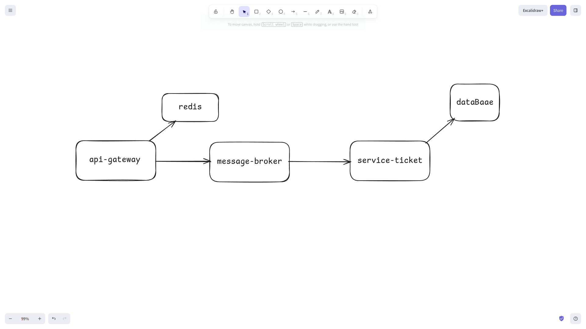

# 🛡️ EdgeGuard

**Status do Projeto:** Em Desenvolvimento 

O **EdgeGuard** é um projeto que terá foco total no seu **API Gateway**. Ele está sendo desenvolvido para atuar como um orquestrador de resiliência e proteção, garantindo que os microserviços de backend sobrevivam a cenários de alta carga e falhas parciais.

### 🎯 Problemas que o EdgeGuard será feito para resolver:

* **Race Conditions:**
* **Cascata de Falhas:**
* **Abuso de Recursos:**
* **Indisponibilidade:**
### 🗺️ Diagrama Inicial da Arquitetura

Este é o esboço da estrutura que está sendo implementada:

