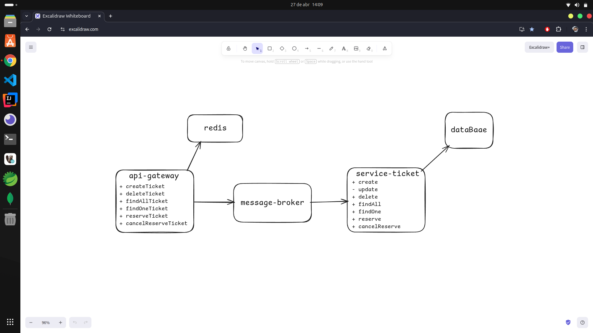
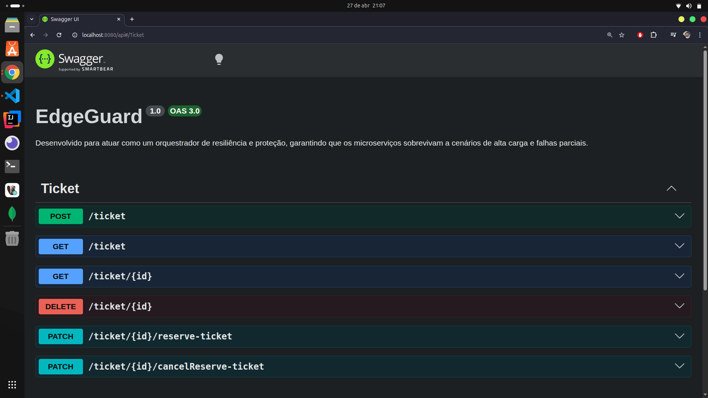
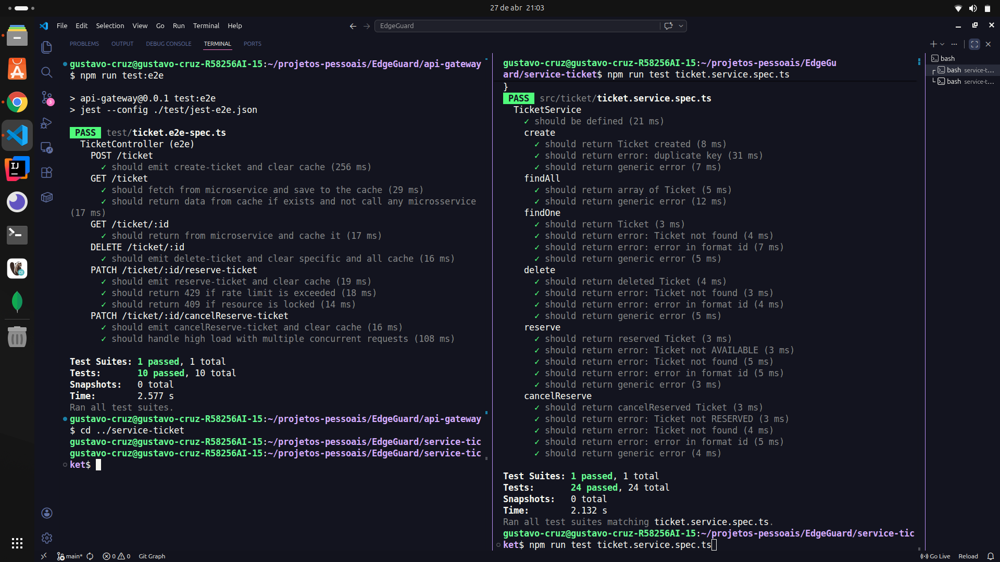
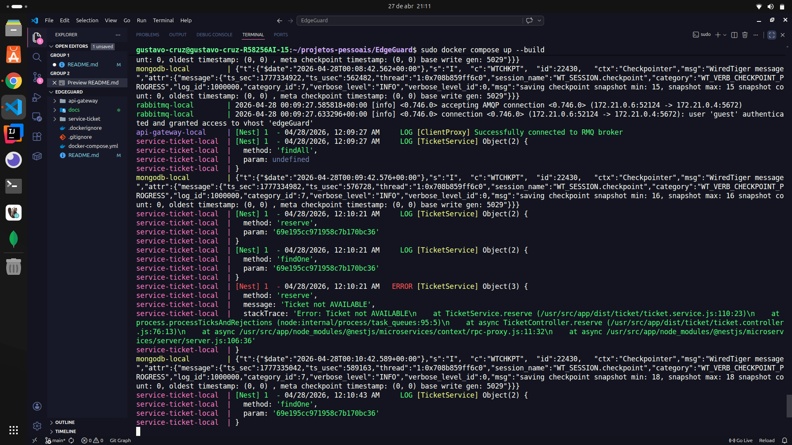

# 🛡️ EdgeGuard — Distributed Protection API Gateway

> API Gateway focado em proteção distribuída, controle de concorrência e mitigação de falhas antes que a carga atinja os microserviços.

---

## 🚀 Status do Projeto


---

## 📌 Sobre o Projeto

O **EdgeGuard** é um API Gateway projetado para atuar como uma camada de **proteção ativa na borda** de arquiteturas distribuídas.

Diferente de gateways tradicionais focados apenas em roteamento, o EdgeGuard intercepta, valida e controla requisições antes que elas atinjam os microserviços.

### Problema que motivou o projeto

Como impedir que:

- múltiplas requisições concorrentes causem **Race Conditions**
- abuso de tráfego sobrecarregue serviços críticos
- falhas de infraestrutura se propaguem em cascata
- o backend receba carga desnecessária antes da lógica de negócio

---

## 🧨 Problemas Resolvidos

- **Race Conditions** em recursos críticos  
- **Flooding / Rate Abuse** por IP  
- **Sobrecarga de Backend** com proteção em borda  
- **Acoplamento entre serviços** com comunicação assíncrona  
- **Falhas em Cascata** por isolamento  

---

## 🏗️ Arquitetura

### 📷 Diagrama da Arquitetura


```text
Client
  → API Gateway
      → RateLimit Guard
      → Atomic Lock Interceptor
      → Cache Layer (Redis)
      → RabbitMQ
          → Ticket Microservice
```

Arquitetura baseada em **pipeline de proteção**, onde cada camada adiciona garantias antes do processamento.

---

## 🔄 Fluxo de Proteção

```text
1. Cliente envia requisição HTTP

2. RateLimit Guard
→ valida quota por IP

3. Lock Interceptor
→ protege recursos críticos com exclusão mútua

4. Cache Layer
→ responde imediatamente em caso de cache hit

5. Cache miss
→ comando é enviado para RabbitMQ

6. Worker consome evento
→ processa de forma assíncrona
```

---

## 📡 Gateway em Execução (Swagger)


Exposição e proteção dos endpoints passando por guards, interceptors e dispatch assíncrono.

---

## 🛡️ Camadas de Proteção

### Distributed Rate Limiting
Proteção de vazão com Redis para evitar abuso e saturação.

### Atomic Resource Locking
Proteção contra concorrência simultânea em operações críticas.

### Cache Shielding
Filtra leituras repetitivas antes do backend.

### Async Load Shedding
Transforma carga síncrona em eventos assíncronos via RabbitMQ.

### Failure Isolation
Isolamento de falhas para evitar propagação para o restante do sistema.

---

## 🧠 Conceitos Aplicados

- API Gateway como camada de proteção  
- Rate Limiting Distribuído  
- Distributed Atomic Locking  
- Cache-Aside Pattern  
- Arquitetura Event-Driven  
- Backpressure Control  
- Failure Isolation  
- Consistência eventual  
- ACK/NACK manual em workers  

---

## ⚙️ Decisões de Engenharia

### 🔹 Distributed Atomic Lock (Redis SET NX)

Implementação com:

- `SET NX EX`
- TTL de 3 segundos para evitar deadlocks
- Lock temporário orientado a eventos assíncronos

### Por que não Redlock?

Como o projeto utiliza apenas **uma instância Redis**, o algoritmo Redlock seria desnecessário.

Foi adotado o trade-off:

- menor complexidade  
- exclusão mútua suficiente para o cenário  
- menor overhead operacional

---

### 🔹 Lock Interceptor em Infraestrutura

O lock é aplicado no gateway via interceptor, não na regra de negócio.

Benefícios:

- proteção transversal
- desacoplamento do domínio
- reutilização automática em endpoints críticos

---

### 🔹 Rate Limiting com Estado Distribuído

Controle centralizado por Redis:

- 6 requisições / 60 segundos
- quota por IP
- rejeição imediata de abuso

---

### 🔹 Custom Client Proxy Abstraction

Camada própria para comunicação RabbitMQ.

Motivação:

- extensibilidade para múltiplos clients/brokers
- padronização do dispatch
- menor acoplamento com abstrações nativas do NestJS

---

### 🔹 Worker Resilience (ACK/NACK)

Consumidores utilizam ACK/NACK manual para:

- evitar perda de mensagens
- reprocessamento controlado
- tolerância a falhas transitórias

---

## ⚖️ Trade-offs

### Simplicidade vs Consenso Distribuído
- `SET NX` ao invés de Redlock

### TTL Locks vs Release Manual
- TTL automático para evitar deadlock

---

## 🧪 Qualidade e Testes

### ⚙️ Testes E2E (Gateway)

Cobertura para cenários críticos:

- concorrência simultânea
- distributed locking
- rate limit throttling
- mocks globais de infraestrutura

---

### ⚙️ Testes Unitários (Service Ticket)

- regras de negócio
- persistência isolada
- mensageria mockada

### 📷 Evidência dos Testes


---

## 🖥️ Execução em Ambiente Real

### 📦 Docker Compose


Infra executada com:

- API Gateway  
- Redis  
- RabbitMQ  
- MongoDB  
- Service Ticket

Execução totalmente isolada e replicável.

---

## 🐳 Execução Local

### 📋 Pré-requisitos

- Docker
- Docker Compose

---

### ▶️ Rodando o projeto

```bash
git clone https://github.com/GUSTAV0-CRUZ/edgeguard.git
cd edgeguard
docker compose up --build
```

---

## 📁 Estrutura do Projeto

```text
edgeguard/
├── api-gateway/
│   ├── src/
│   │   ├── common/
│   │   │   ├── guards/
│   │   │   ├── interceptors/
│   │   │   └── filters/
│   │   ├── redis/
│   │   ├── ticket/
│   │   └── client-proxy-rmq/
│
├── service-ticket/
├── docker-compose.yml
└── README.md
```

---

## 🛠️ Stack Tecnológica

| Categoria | Tecnologia |
|---------|------------|
| Backend | NestJS |
| Cache / Lock | Redis |
| Mensageria | RabbitMQ |
| Banco de Dados | MongoDB |
| Testes | Jest + Supertest |
| Containerização | Docker + Compose |

---

## 📚 Aprendizados

- Proteção de sistemas distribuídos na borda  
- Controle de concorrência em infraestrutura  
- Redis para locking e throttling  
- Desacoplamento com mensageria  
- Trade-offs em arquiteturas resilientes  

---

## 👨‍💻 Autor


**Gustavo Cruz**  
💼 Backend Developer (Node.js | NestJS | Microservices)  
📧 gustavo.cruzs.dev@gmail.com

🔗 https://github.com/GUSTAV0-CRUZ